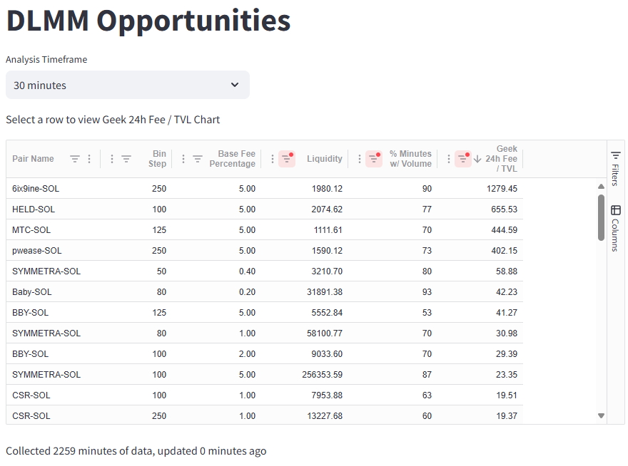
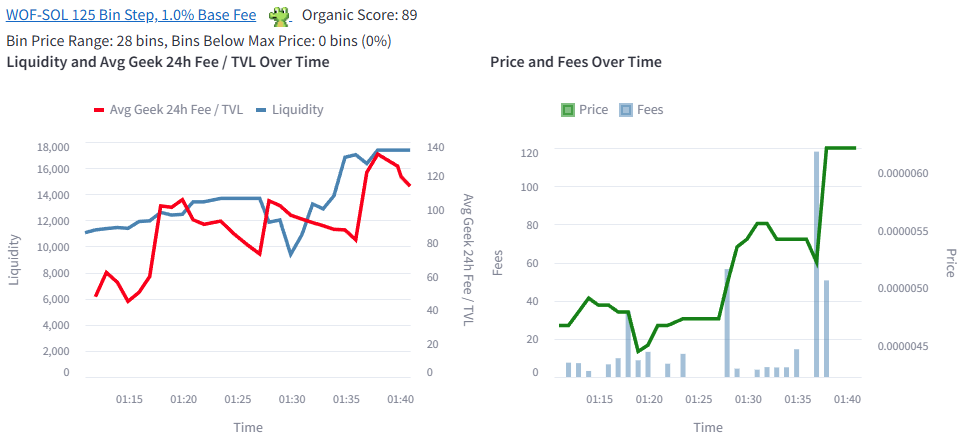

# Meteora API Time Series Collector

This project is a Python application that periodically polls the [Meteora API](https://dlmm-api.meteora.ag/swagger-ui/#/) to collect DLMM data and stores it in a [DuckDB](https://duckdb.org/) database. The application is designed to build a time series of DLMM history.

The motivation behind the project was to better identify DLMM opportunities from analyzing liquidity and fees over time. The 24 Hour Fees / TVL metric is a poor indicator, because liquidity frequently moves in and out of pools. The current liquidity (in the denominator) may not be representative of the actual liquidity that generated the fees (in the numerator).





## Features

- **Periodic API Polling:**  
  Uses APScheduler to call the Meteora API every minute.

- **Robust Error Handling:**  
  Integrates Tenacity for retries with exponential backoff and ratelimit to prevent exceeding API rate limits.

- **Time Series Data Collection:**  
  The data from each API call response (with a timestamp) is stored in a DuckDB database for time series analysis.

- **Streamlit Web UI**
  Filter/sort opportunities in a table, and view the time series data in a graph.

## Attribution
You are encouraged to use this library to build your own Meteora DLMM community tools. If do you use this library in another project, please be sure to provide attribution to [@kVOTHED](https://x.com/CryptoKvothed) and [@GeekLad](https://x.com/GeekLad).

## Installation

1. **Clone the Repository:**

   ```bash
   git clone https://github.com/cryptokvothed/meteora-dlmm-project.git
   cd meteora-dlmm-project
   ```

2. **Create a Virtual Environment (optional but recommended):**

   ```bash
   python -m venv venv
   source venv/bin/activate   # On Windows: venv\Scripts\activate
   ```

3. **Install Dependencies:**

   ```bash
   pip install -r requirements.txt
   ```

4. **Configuration (optional):**

   Rename the `.env.sample` file to `.env`, and update accordingly.

   Environment variables:
   - **API_BASE_URL:** The base URL for the Meteora API
   - **LOG_LEVEL:** The log level, set to `DEBUG` for more verbose logging
   - **DEFAULT_LIMIT:** The number of pairs to fetch per page from the API
   - **DB_FILENAME:** The filename for your DuckDB database
   - **RATE_LIMIT_CALLS** and **RATE_LIMIT_PERIOD:** For rate limiting (e.g., 30 calls per minute)

## Usage

### Load Database
To start collecting data, run:

```bash
python load_database.py
```

The script will poll the Meteora API every minute.  It will only fetch pairs 
that have had volume within the last 30 minutes, and load the data into a 
DuckDB database (default file: `meteora_dlmm_time_series.duckdb`).

Press `Ctrl+C` to stop the scheduler gracefully.

### Launch Web UI
The web UI is a [Streamlit](https://streamlit.io/) app.  To start it run:

```
streamlit run app.py --server.headless true
```

The database will have to have collected at least 5 minutes worth of data in order for the web UI to display data.

## Technologies Used
- [Meteora DLMM API](https://dlmm-api.meteora.ag/swagger-ui/): API for obtaining Meteora DLMM data
- [DuckDB](https://duckdb.org/): An awesome, performant, single-file database similar to SQLite, but more robust
- [Streamlit](https://streamlit.io/): A Python library to quickly build a web UI for data-driven applications
- [streamlit-aggrid](https://github.com/PablocFonseca/streamlit-aggrid): A python library that brings [AG Grid](https://www.ag-grid.com/) to Streamlit

## License

This project is open source and available under the [MIT License](LICENSE.md).

## Contributing

Feel free to submit issues or pull requests if you have suggestions or improvements.